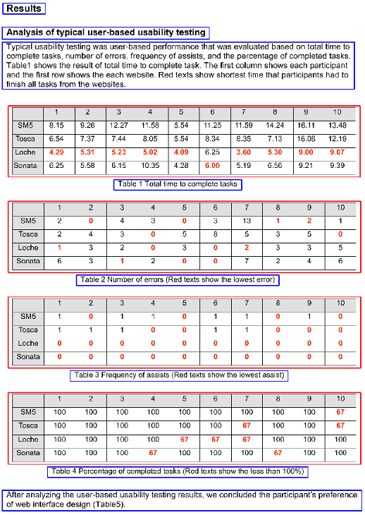

# TextTableLocalizationIP
Text, Table Localization and Detection for Scientific Document using OpenCV.

## Running the algorithm
### Runs only on Windows Operating System
- Run main.py using a Python IDE on a Windows PC.  
- It is recommended to run this algorithm on Python IDEs that supports the integration of OpenCV such as Spyder.  
- Make sure OpenCV is installed.

## Problem Description
The aim of my code is to detect the location of all the texts in sections of paragraphs and tables in a set of scientific documents. The code should be able to differentiate texts and objects written on a blank white document. Tables will be identified separately from texts. To better identify paragraphs and tables, I specifically separate the two elements into different colours: blue and red respectively.

## Expected Output

## Built On/With
Built On : Python  
Built With : Spyder
